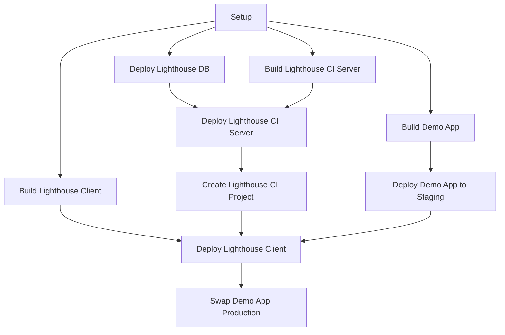

# Lighthouse CI on Microsoft Azure

## Description

This repository provides continuous integration and deployment processes using GitHub workflow to create and maintain a Lighthouse CI solution hosted on Microsoft's Azure platform.
This solution also provides a demo Web application so the Lighthouse would able to run the audits on it.

## Prerequisites accounts

- [Azure Account](https://azure.microsoft.com)
- [GitHub Account](https://github.com)

## Main Components

- **Demo Web Application** (`./demo-app`): Web application that is used to run the Lighthouse audits on it.

- **Lighthouse CI Client** (`./lighthouse-ci/client`): Responsible for running the Lighthouse audits on the demo Web application.

- **Lighthouse CI Server** (`./lighthouse-ci/server`): Responsible for storing the Lighthouse audits reports, and providing a web interface for viewing the reports.

## Hight Level Architecture

On every push to the `main` branch, the GitHub Actions workflow will run the following steps:

1. Deploy the demo Web application to a staging slot.
2. Run the Lighthouse audits on the staging slot and store the reports in the Lighthouse CI Server.
3. If the audits passed, swap the demo Web application's staging slot with the production slot.

## GitHub Actions Workflow diagram

### Provisioned Azure Resources

- **Azure Resource Group**: A logical container for grouping the Azure resources that are required to run this solution.

- **Azure Container Registry**: Host the Docker images for the demo Web application and the Lighthouse CI Client & Server.

- **Azure Database for MySQL**: The database for the Lighthouse CI Server.

- **Azure Container Apps**: Host the demo Web application Lighthouse CI Server.

- **Azure Container Instance**: Running the Lighthouse CI Client.

- **Azure Key Vault**: Store the Lighthouse CI project tokens.

## Setup

### 1. Fork this repository

Fork this repository to your GitHub account by clicking the **Fork** button at the top of this page.

### 2. Create an Azure Subscription

If you do not have an Azure subscription, create a new one:

1. Log in to the [Azure Portal](https://portal.azure.com).
2. Navigate to the **Subscriptions** service.
3. Click **Add**.
4. Follow the steps to create a new subscription.
5. Note down the subscription id for the `AZURE_SUBSCRIPTION_ID` GitHub secret later.

### 3. Create an Azure Active Directory (AAD) Application

The AAD Application acts as an identity for the GitHub Actions workflow to interact with Azure services.

1. Log in to the [Azure Portal](https://portal.azure.com).
2. Navigate to the **App registrations** service.
3. Click **New registration**.
4. Enter a name for the application, and then click **Register**.
5. Once the application is created, note down the **Application (client) ID** (`AZURE_CLIENT_ID`) and **Directory (tenant) ID** (`AZURE_TENANT_ID`) for the GitHub secrets later.

### 4. GitHub Actions Workflow federated credentials

The GitHub Actions workflow needs to be able to authenticate with Azure using the AAD Application that you created earlier.

1. Navigate to your AAD application that you created earlier.
2. Navigate to the **Certificates & secrets** view.
3. Navigate to the **Federated credentials** tab.
4. Click **Add credential**.
5. Select **GitHub Actions deploying Azure resources** as the Federated credential scenario.
6. Enter your GitHub organization name and repository name.
7. Select **Branch** as the Entity type and fill in **main** as the GitHub branch name.
8. Generate a name for the federated credential.
9. Click **Add**.

### 5. Assign Owner Role to the AAD Application

The AAD Application needs to be assigned as a Owner role on your Azure subscription so it can create and manage the Azure resources.

1. Navigate to your Azure subscription.
2. Select **Access control (IAM)**, then click **Add role assignment**.
3. In the **Role** pane, select **Privileged administrator role** and select _Owner_ as the role
4. Click **Next** or **Members**, select **Assign access to** to **User, group, or service principal**, and select the AAD application that you created earlier.
5. Click **Assign**.

### 6. Set GitHub Variables

In your GitHub repository, go to **Settings** -> **Secrets and variables** -> **Actions** -> **Variables** -> **New repository secret** and add the following variables:

- `APP_NAME`: Generate an unique application name. Lowercase words separated by dashes. For example, `my-app`.

### 7. Set GitHub Secrets

In your GitHub repository, go to **Settings** -> **Secrets and variables** -> **Actions** -> **New repository secret** and add the following secrets:

- `AZURE_CLIENT_ID`: The Application (client) ID of the AAD application you created earlier.
- `AZURE_TENANT_ID`: The Directory (tenant) ID of the AAD application.
- `AZURE_SUBSCRIPTION_ID`: The Subscription ID of your Azure subscription.

### 8. Run the GitHub Action Workflow

Once everything is set up, you can now run the GitHub Actions workflow by pushing a commit to the `main` branch.
